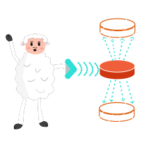

** STATUS: BETA VERSION **

### Closha

Closha is a script for local-only backups.

Features:

- multiple inputs and outputs;

- running arbitrary commands to produce inputs, such as creating a tarball and/or encrypting;

- saving and validating checksums to detect bitrot;

- configuring how many versions of a backup to keep;

- autoreplicating to plugged in USB sticks that have a "closha" directory in root;

- a compact (< 400 lines), well-commented pure Bash implementation that is easy to audit.

All of that without registration, cloud fees, AI, leaking your data to corporations or age 
verification!

#### Installation

    doas make install
    
To uninstall, run "doas make uninstall".

To make an Arch Linux package, run

    make package
    
and then install the package with

    doas pacman -U closha-...pkg.tar.zst
    
(or by adding it to your local directory and installing it from there). 

#### Example

Create one or more files in ~/.config/closha with the following structure:

    output = ~/backups
   
    keepVersions = 4
   
    input = ~/path/to/file
 

Place the script within your path and run it. The script will run the command you've written in 
`inputCommand` and expect the file you've named in `inputResult`; this file will be moved to
something like 

    ~/backups/file.tar.xz.123.bak

its SHA-256 checksum will be saved as 

    ~/backups/file.tar.xz.123.sha256

and an older backup (two files: file.tar.xz.119.{bak,sha256}), if it exists, will be deleted.

#### General properties

The backup id (appended to the file name as 123.bak) is an ever-incrementing integer starting at 0.
The number of versions of a backup to keep is set per config file ("keepVersions = 4").

The script checks if the new file happens to have the same size and content as previous backup, 
and avoids superfluous overwriting. I.e. the script is idempotent. All outputs are checked 
separately.

You can have multiple inputs and multiple outputs (each input will be backed up to each output).
You can also have multiple config files and they will all be executed.

#### Generating inputs by arbitrary command

To have a generated input (for example, when you need to compress a dir and/or encrypt something),
use the "inputCommand" + "inputResult" combo:

    output = ~/backups
   
    keepVersions = 4
   
    inputCommand = tar -I 'xz 9' --exclude .git -c \
   
       ~/repos/myRepo -f ~/.local/share/closha/myRepo.tar.xz
   
    inputResult = ~/.local/share/closha/myRepo.tar.xz

Note that the "inputResult" file will be deleted. It's supposed to be a temporary generated by
the "inputCommand". If you want to back up a file without deletion, use "input" as shown in the
first example above.

#### Restoring backups

To restore a backup, run it as 

    closha ~/backups/myFile.txt.123.bak
   
And it will validate the checksum and copy that file to  

    ~/backups/myFile.txt
    
(i.e. to the backup directory).

Also the script detects if it's an archive (supported extensions are .tar.{zst,gz,xz}) and
unpacks it in the same dir if true (while deleting the archive).

#### The most beautiful feature

But the coolest thing is auto backing up to multiple plugged in USB sticks. Just create the dir
"closha" at the toplevel of your stick and plug it in (no need to mount!). Better yet, have 3 or
more of such USB sticks plugged in. The script will auto-mount them, check for presence of the dir
and back up all inputs to all of the relevant sticks simultaneously. This will make for a simple 
RAID array to ensure your data's integrity, all with just one command!

### Name

Name "closha" is a combination of "clone" and a Russian feminine hypocorism.
